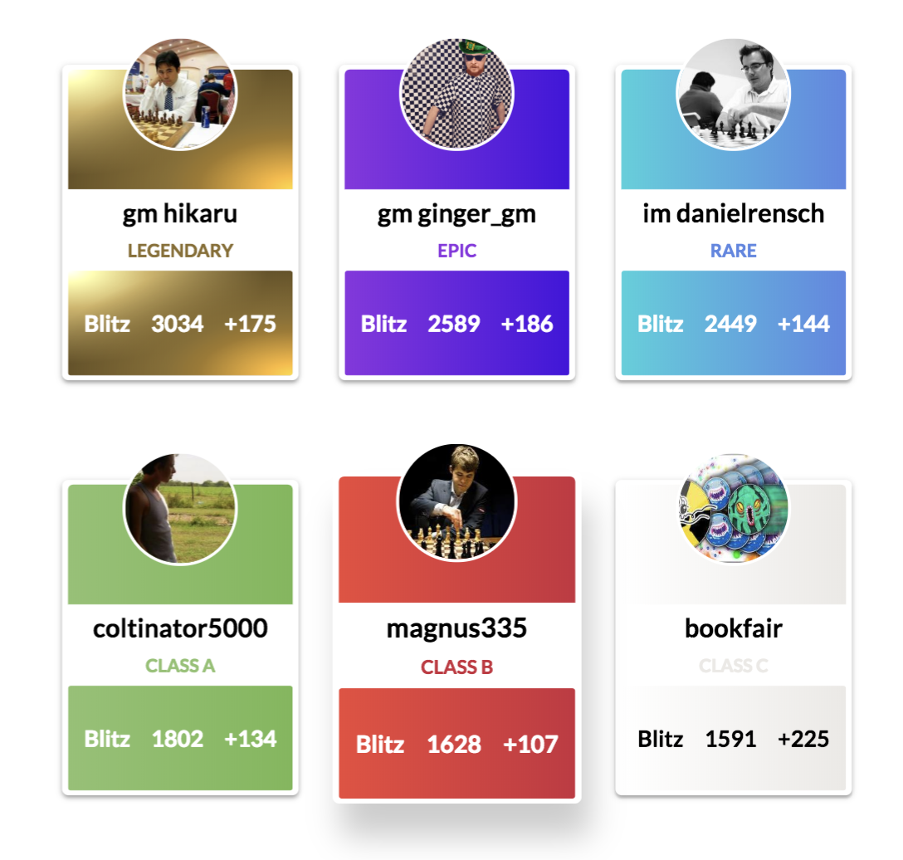

**Baseball card for chess**

### [Who's Hot?](https://willb335.github.io/chess-cards/)

The demo shows an easy way to display who is having a positive run on the site. It allows club players to be listed side by side with titled players while still displaying the class of player via a category, 'legendary' being the highest and 'novice' being the lowest. The data on the cards is mocked.
