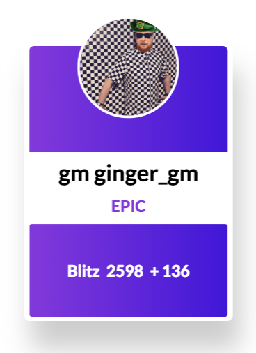
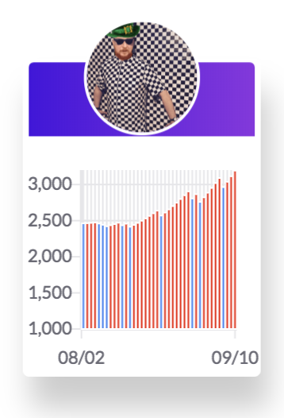

**A proof of concept for chess cards**

I wanted to play around with the idea of a baseball card for chess. A physical card can't hold a lot of information but with components like tabs and tooltips html cards can hold a lot of information without clutter.

### [Who's Hot?](https://willb335.github.io/chess-cards/)

A potential implementation of chess cards, The demo shows an easy way to display who is having a nice run on the site. It allows club players to be listed side by side with titled players while still displaying the class of player via a category, 'legendary' being the highest and 'novice being the lowest'. The data on the cards is mocked.
